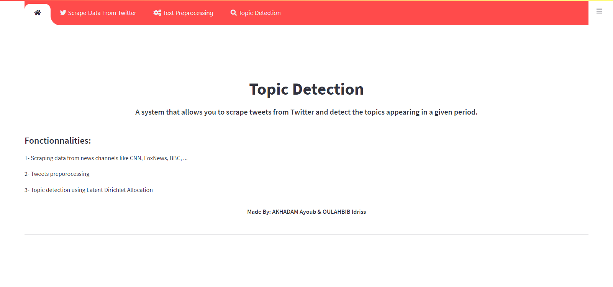
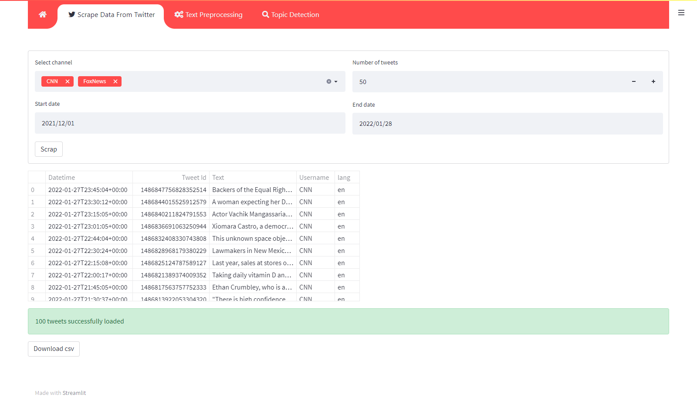
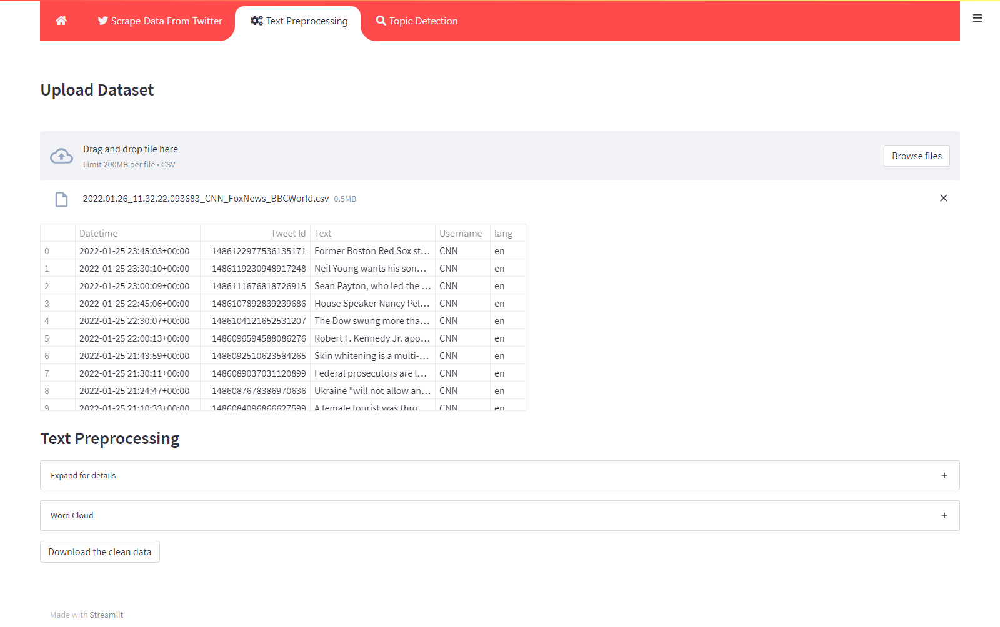
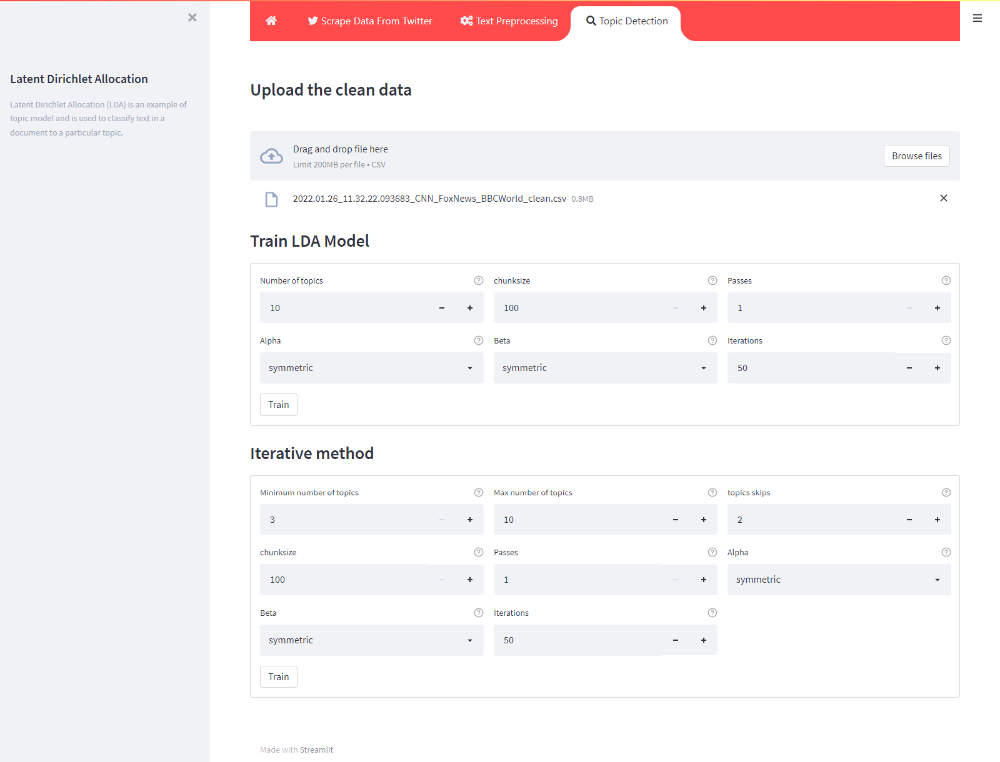
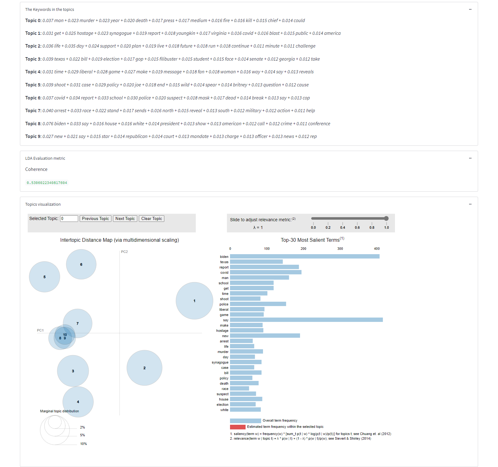

# topic-detection

A system that scrapes news data from Twitter and performs topic detection for a specified period. The system is designed to collect news-related tweets and extract the main topics discussed during the given time frame.

### Functionalities::

- Scraping Twitter data from news channels like CNN, FoxNews, BBC, ...
- Tweets preprocessing
- Topic detection using Latent Dirichlet Allocation (LDA)

### Screens

